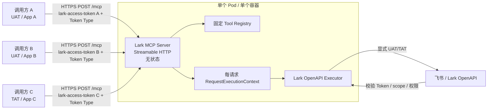

# 单实例无状态 Lark MCP Server 改造方案

状态：核心 passthrough 改造已落地，待部署联调

基线核验日期：2026-09-15

目标读者：Lark MCP 开发、测试和部署人员

目标仓库：[GatewayJ/lark-openapi-mcp](https://github.com/GatewayJ/lark-openapi-mcp)

基线提交：[`2192035`](https://github.com/GatewayJ/lark-openapi-mcp/commit/21920354ec6e3966b52e89152620c5085e496b55)

## 1. 结论

`GatewayJ/lark-openapi-mcp` 可以作为改造基础，但当前代码不能直接满足目标。

目标不是建立远端多租户账号系统，而是部署 **一个无状态 Lark MCP Server 实例**：不同用户、不同飞书 App 的调用请求各自携带 `user_access_token` 或 `tenant_access_token`，共同复用该实例。Server 不识别或保存用户、租户和 App，不执行 OAuth，不保存或刷新 Token，也不验证独立的 MCP 服务 Token。

两种 Token 都必须实现，来源和职责固定如下：

- UAT：由 CSGClaw Connector 完成用户 OAuth 会话、刷新并在调用时传入。
- TAT：由 CSGClaw Connector 使用对应飞书 App 的凭证获取、刷新并在调用时传入。
- MCP Server 只消费调用方传来的现成 UAT/TAT；不接收 App Secret，不调用凭证签发接口，也不承担 Token 生命周期管理。

目标调用契约：

```http
POST /mcp HTTP/1.1
lark-access-token: <LARK_ACCESS_TOKEN>
X-Lark-Token-Type: user_access_token | tenant_access_token
Content-Type: application/json
Accept: application/json, text/event-stream
```

`lark-access-token` 在本模式中直接承载飞书 Access Token，不是 MCP Server 自身的认证凭证。`Authorization` 保留给 OpenCSG Space、API Gateway 或其他中间代理系统做平台鉴权。Server 在凭证层只检查 Header 是否完整、Token Type 是否为允许枚举，并根据 Tool 元数据约束允许的 Token Type；Token 真伪、有效期、scope、App 权限和用户权限由飞书 OpenAPI 校验。

## 2. 范围与边界

### 2.1 本方案包含

- 单个 Node.js 进程/容器提供 Streamable HTTP `/mcp`。
- 多个调用方按请求携带不同的 UAT/TAT，复用同一个实例。
- 固定的 Tool allowlist 与 Tool Schema。
- 每请求不可变凭证上下文。
- UAT/TAT 显式注入所有 Lark SDK、fallback request 和 custom handler。
- 飞书错误到 MCP Tool error 的稳定映射。
- 健康检查、容器构建和运行状态展示。
- 新增独立的远端透传模式；legacy standalone 代码可以继续留在仓库中，但其 TAT 行为和兼容性不属于本次改造与验收范围。

### 2.2 本方案不包含

- Connector、CSGClaw、Codex Plugin 的实现修改。
- 飞书 OAuth 页面、callback、授权码交换和 refresh token 管理。
- MCP OAuth、MCP Access Token 或调用方账号认证。
- 租户/App/用户注册、Connection Grant、数据库、Redis、Token Vault。
- 多 Pod、负载均衡或水平扩容设计；当前部署固定一个 Pod/容器。
- 由 Tool 参数覆盖 Token、用户、App 或身份类型；兼容参数 `useUAT` 可以保留，但只能用于声明并校验期望身份，不能改变 Header 指定的实际身份。
- 日志脱敏、Trace/metrics 敏感信息治理；本阶段不修改 logger/redactor，也不把相关要求作为验收条件。

## 3. 当前代码状态

### 3.1 仓库状态

`GatewayJ` fork 当前只有 `main` 分支，最新提交与官方 `larksuite/lark-openapi-mcp` 的 `main` 相同。因此该 fork 还没有包含本方案所需的无状态改造。

本机核验结果：

| 检查项 | 当前状态 | 结论 |
|---|---:|---|
| package 版本 | `0.5.1` | 当前基线 |
| Node.js | `v22.13.0` | 满足 `>=20` |
| `@larksuiteoapi/node-sdk` | `1.50.0` | 支持 `withUserAccessToken` / `withTenantToken` |
| `@modelcontextprotocol/sdk` | `1.12.1` | 已有 Streamable HTTP Server |
| TypeScript `tsc --noEmit` | 通过 | 当前源码可编译 |
| Jest | 398/407 通过，9 失败 | 基线不是全绿；6 个 suite 失败，并存在未退出的异步句柄 |
| 实际远端部署 | 未核验 | 未提供部署 URL/容器环境，本文只展示代码可部署性与目标状态 |

现有失败主要来自 logger 输出前缀与旧断言不一致、`fs` mock 不完整以及测试异步资源未关闭。它们不都是本方案引入的问题，但在开始改造前应先记录基线，并在最终合并前恢复全绿。

### 3.2 已经可以复用的能力

- 已支持 `streamable` 模式和 `POST /mcp`。
- 当前 Streamable 实现使用 `sessionIdGenerator: undefined`，属于无会话的请求处理方式。
- 当前每个 HTTP POST 创建独立 `McpServer` 与 transport，请求关闭时销毁，天然适合做 Token 隔离的第一版实现。
- 绝大多数 OpenAPI 工具定义已经带有 `accessTokens: ['user' | 'tenant']` 元数据；中英文各 5 个 `auth.v3.*` 凭证签发工具是例外，必须在 passthrough 模式硬禁。
- 普通生成型 Tool 统一经过 `larkOapiHandler`，便于集中改造。
- Lark Node SDK 已提供 `withUserAccessToken` 和 `withTenantToken`。
- 工具 allowlist、preset、语言和命名格式已经存在启动配置。

### 3.3 与目标不一致的地方

| 当前行为 | 代码位置 | 问题 |
|---|---|---|
| 启动 OAPI Server 强制要求 App ID/App Secret | [`src/mcp-server/shared/init.ts`](../../src/mcp-server/shared/init.ts) | 远端仍绑定一个固定 App，不能成为纯 Token 透传服务 |
| 非 OAuth 模式把 `Authorization` 一律写入 `userAccessToken` | [`src/mcp-server/transport/streamable.ts`](../../src/mcp-server/transport/streamable.ts) | 只能表达 UAT，不能表达 TAT |
| Token 类型由全局 `--token-mode` 或 Tool 参数 `useUAT` 决定 | [`src/mcp-tool/mcp-tool.ts`](../../src/mcp-tool/mcp-tool.ts) | 不能在同一实例内安全混用不同请求身份 |
| tenant 模式不显式传 Token，SDK 使用固定 App 凭证自动获取 TAT | [`src/mcp-tool/utils/handler.ts`](../../src/mcp-tool/utils/handler.ts) | TAT 不是请求级，多个 App 会共享错误身份 |
| LarkMcpTool 保存可变 `userAccessToken`，并支持刷新/重新授权 | [`src/mcp-tool/mcp-tool.ts`](../../src/mcp-tool/mcp-tool.ts) | 远端存在 Token 状态与 OAuth 行为 |
| `auth` barrel 会导入单例 `authStore` | [`src/auth/index.ts`](../../src/auth/index.ts) | 即使不启用 OAuth，也会触发 `StorageManager`/`AuthStore` 的异步初始化和文件监听尝试 |
| CLI 与多个 barrel 存在到 `authStore` 的静态导入链 | [`src/cli.ts`](../../src/cli.ts)、[`src/mcp-server/index.ts`](../../src/mcp-server/index.ts)、[`src/mcp-server/transport/index.ts`](../../src/mcp-server/transport/index.ts)、[`src/mcp-tool/index.ts`](../../src/mcp-tool/index.ts) | Node.js 在解析 `--credential-mode` 前已经执行静态 import；仅增加运行时分支不能实现无状态隔离 |
| tools、language、toolNameCase、tokenMode 可从请求 query 覆盖 | [`src/mcp-server/shared/types.ts`](../../src/mcp-server/shared/types.ts)、[`transport/utils.ts`](../../src/mcp-server/transport/utils.ts) | 调用方可以改变 Server 的固定工具面与身份策略 |
| custom handler 直接走默认 Client 或只处理 UAT | [`src/mcp-tool/tools/zh/builtin-tools`](../../src/mcp-tool/tools/zh/builtin-tools)、[`en/builtin-tools`](../../src/mcp-tool/tools/en/builtin-tools) | 会绕开统一的请求 Token 注入 |
| 中英文各 5 个 `auth.v3.*` 工具的 `accessTokens` 为 `undefined`，且参数可接收 App Secret | [`src/mcp-tool/tools/zh/gen-tools/zod/auth_v3.ts`](../../src/mcp-tool/tools/zh/gen-tools/zod/auth_v3.ts)、[`en/gen-tools/zod/auth_v3.ts`](../../src/mcp-tool/tools/en/gen-tools/zod/auth_v3.ts) | 若 allowlist 显式包含这些工具，Server 会越界成为凭证签发代理 |
| Dockerfile 安装 `@larksuiteoapi/lark-mcp@latest` | [`Dockerfile`](../../Dockerfile) | 构建 fork 镜像时不会运行 fork 中的源码修改 |
| 没有 `/healthz`、`/readyz` 与结构化运行状态 | [`src/mcp-server/transport/streamable.ts`](../../src/mcp-server/transport/streamable.ts) | 部署平台无法可靠展示存活和就绪状态 |

### 3.4 当前可用程度判断

当前代码只能在以下受限场景中“部分复用”：

1. Server 仍配置一个固定 App ID/App Secret。
2. 全局固定 `--token-mode user_access_token`。
3. 每个请求在 `Authorization` 中传 UAT。

该方式可以让多个 UAT 请求经过同一进程，但它仍需要远端 App Secret，不支持每请求 TAT，不支持 UAT/TAT 混用，而且错误路径仍带有重新授权语义。因此不能作为目标生产方案。

## 4. 目标部署与使用状态

### 4.1 部署拓扑



核心含义：

- 只有一个 Lark MCP Server 实例，不画 Pod 1/2/N。
- 用户/App 的差异只存在于单次请求携带的 Token 中。
- Server 不知道“用户 A”“App B”是谁，也不建立绑定关系。
- 请求结束后释放 Token 上下文；服务重启不需要恢复业务状态。
- 共享的是代码、Tool Registry、Schema 和无凭证连接池，不共享 Token。

### 4.2 目标运行状态

| 项目 | 目标状态 |
|---|---|
| 实例数 | 1 个 Pod/容器 |
| MCP Transport | Streamable HTTP，stateless |
| 对外地址 | `https://<host>/mcp` |
| MCP 服务认证 | 无 |
| 飞书凭证来源 | 每个 `tools/call` 请求的 Header |
| 支持身份 | `user_access_token`、`tenant_access_token` |
| App ID/App Secret | Server 不配置、不保存 |
| OAuth/AuthStore | 不启动、不导入、不落盘 |
| 数据库/PVC | 无 |
| Tool 集合 | Server 启动时固定 |
| Token 校验 | 飞书 OpenAPI 最终校验 |
| 日志 | 沿用现有日志能力；日志脱敏改造不在本阶段范围 |
| 重启恢复 | 无需恢复 Token、用户或租户数据 |

### 4.3 安全含义

这是一个没有调用方认证的公开协议适配器。任何知道服务地址并持有任意有效飞书 Access Token 的调用方，都可以调用 Server 暴露的 Tool。

因此至少需要：

- 全程 HTTPS，禁止明文 HTTP 跨主机传 Token。
- 固定且尽量小的 Tool allowlist；请求不能动态扩大。
- 限制请求体大小、Header 长度、并发数和全局速率。
- 只允许访问配置的飞书/Lark OpenAPI 域名，不能成为任意 URL 代理。
- 不用 HTTP 401/`WWW-Authenticate` 表达飞书 Token 失效，避免 MCP Host 误认为需要 MCP OAuth。

传输层可以使用部署平台的普通 TLS Ingress/反向代理，但它只负责 HTTPS，不承担本方案中的身份认证，也不增加第二个业务 Pod。

日志脱敏、Trace 和 metrics 敏感信息治理由其他工作项处理，不阻塞本方案的核心实现与验收。

## 5. 外部协议契约

### 5.1 Header

| Header | initialize/tools/list | tools/call | 说明 |
|---|---:|---:|---|
| `lark-access-token: <token>` | 可选 | 必填 | 直接传 Lark UAT/TAT，不带 `Bearer` 前缀 |
| `X-Lark-Token-Type` | 可选 | 必填 | 只允许 `user_access_token` / `tenant_access_token` |
| `X-Request-Id` | 可选 | 可选 | 未提供时 Server 生成；仅用于日志关联 |
| `Content-Type: application/json` | 必填 | 必填 | MCP JSON-RPC |
| `Accept: application/json, text/event-stream` | 建议 | 建议 | 兼容 Streamable HTTP 返回 |

处理规则：

1. `lark-access-token` 解析必须严格，拒绝缺失 Token、空 Token、控制字符、重复 Header、超长值、空白字符和 `Bearer` 前缀。
2. 不从 Token 字符串猜类型；必须使用 `X-Lark-Token-Type`。
3. 不把 Token 写入 `req.auth` 作为“已验证的 MCP 身份”；它只是下游 Lark 凭证。
4. 不允许 query string 或 Tool arguments 覆盖 Token Type。兼容参数 `useUAT` 保留在原 Tool Schema 中，但只作为身份一致性声明：缺省时由 Header 决定；显式值与 Header 一致时继续执行；发生冲突时立即返回 `identity_override_not_allowed`，且不调用飞书。
5. 不允许请求携带 tools、language、toolNameCase、domain 等 Server 配置。
6. `tools/list` 返回部署时 allowlist 中全部工具；`tools/call` 再根据工具的 `accessTokens` 元数据校验当前 Token Type。
7. passthrough Tool Registry 采用 fail-closed：allowlist 中任何工具只要缺少非空 `accessTokens` 元数据，Server 就拒绝启动并报告具体 Tool 名称。
8. 无论 allowlist、preset 或 project 如何配置，passthrough 模式都硬禁 5 个逻辑上的 `auth.v3.*` 凭证签发工具；中英文生成定义共 10 个对象，但对应同一组 Tool 名称。

`useUAT` 一致性矩阵：

| `X-Lark-Token-Type` | `useUAT` 缺省 | `useUAT: true` | `useUAT: false` |
|---|---|---|---|
| `user_access_token` | 使用 Header UAT | 使用 Header UAT | 返回冲突错误 |
| `tenant_access_token` | 使用 Header TAT | 返回冲突错误 | 使用 Header TAT |

冲突错误固定为：

```json
{
  "code": "identity_override_not_allowed",
  "message": "passthrough 模式不允许使用 useUAT，Token 类型由请求 Header 决定"
}
```

该对象作为 `isError: true` 的 MCP Tool Result 返回。实现必须区分 `useUAT` 缺省与显式 `false`，不能使用 `params.useUAT ?? false` 将二者合并。

### 5.2 错误语义

| 场景 | Server 行为 |
|---|---|
| tools/call 缺少 Token | 返回 MCP/JSON-RPC 参数错误，不调用飞书 |
| Token Type 非法 | 返回 `invalid_token_type` |
| `useUAT` 与 Header Token Type 冲突 | 返回 `identity_override_not_allowed`，不调用飞书 |
| Tool 不支持该 Token Type | 返回 `token_type_not_supported` |
| 飞书 Token 失效/过期 | 转换为 `lark_token_invalid`，保留飞书 code/request_id，不刷新 |
| scope/权限不足 | 返回 `lark_scope_missing` 或原始飞书权限错误，不回退另一身份 |
| 飞书 429/5xx | 返回带 `retryable` 分类的上游错误 |
| Server 内部异常 | 返回稳定的 `internal_error` |

飞书鉴权失败属于 Tool 执行结果，不应返回 HTTP 401，也不应发布 `WWW-Authenticate`。Token 刷新或重新授权由调用方负责。

## 6. 内部执行模型

### 6.1 请求上下文

```ts
export type LarkTokenType =
  | 'user_access_token'
  | 'tenant_access_token';

export interface RequestCredential {
  type: LarkTokenType;
  accessToken: string;
}

export interface RequestExecutionContext {
  requestId: string;
  credential?: RequestCredential;
  signal?: AbortSignal;
}
```

### 6.2 推荐的第一版隔离方式

保留当前“每个 HTTP POST 创建一个 `McpServer` + `StreamableHTTPServerTransport`”的方式，并把不可变 `RequestExecutionContext` 传入当次 Server/Tool handler。

理由：

- 改动小，与当前 stateless transport 一致。
- Token 被闭包限制在一次 HTTP 请求内，最容易证明不会串 Token。
- 不需要 `AsyncLocalStorage`、全局 currentToken 或共享可变 Client。
- 请求关闭时沿用现有 `transport.close()` 和 `server.close()`。

可以在启动时预计算只读 Tool Catalog 和 Schema，减少每请求过滤成本；不要为性能把 Token 放进共享单例。

### 6.3 Lark SDK Client

passthrough 模式需要一个不自动获取 Token 的 Client：

```ts
const client = new lark.Client({
  appId: '__passthrough__',
  appSecret: '__passthrough__',
  domain,
  disableTokenCache: true,
  httpInstance: oapiHttpInstance,
  logger: noopLogger,
});
```

所有调用必须传第二个 request option：

```ts
function withRequestCredential(credential: RequestCredential) {
  return credential.type === 'user_access_token'
    ? lark.withUserAccessToken(credential.accessToken)
    : lark.withTenantToken(credential.accessToken);
}
```

`disableTokenCache: true` 是关键防线：任何漏传 request option 的路径都应该因缺少 Authorization 失败，而不是使用占位 App 凭证去飞书换 TAT。

必须增加测试，断言 passthrough 模式永远不向飞书访问：

```text
/open-apis/auth/v3/app_access_token
/open-apis/auth/v3/app_access_token/internal
/open-apis/auth/v3/app_ticket/resend
/open-apis/auth/v3/tenant_access_token
/open-apis/auth/v3/tenant_access_token/internal
```

同时断言 passthrough HTTP 应用没有注册本地 `/authorize`、`/callback`、`/token` 路由。

### 6.4 模块加载隔离

仅在运行时判断 `credentialMode === 'passthrough'` 不够。Node.js 会在 CLI 参数解析前执行所有静态 import，而当前存在以下隐藏链路：

```text
src/cli.ts
  ├─ LoginHandler
  │    └─ authStore -> StorageManager -> keytar/文件初始化
  └─ mcp-server barrel
       └─ transport barrel
            └─ stdio.ts -> authStore

mcp-tool barrel
  └─ mcp-tool.ts -> auth barrel -> authStore
```

目标加载链必须拆成两个互不污染的入口：

```text
CLI 解析命令/credential mode
  ├─ passthrough -> 动态导入 passthrough init -> streamable passthrough -> 无状态 executor
  └─ standalone  -> 动态导入 legacy init/login/stdio/sse -> authStore/OAuth
```

具体约束：

1. `src/cli.ts` 顶层不得静态导入 `LoginHandler` 或会导出 standalone transport 的 `mcp-server` barrel；在具体 command action 内按需动态导入。
2. passthrough 代码只直接导入所需的 tools、types 和 streamable 实现，不经过同时导出 `mcp-tool.ts`、`stdio.ts`、`sse.ts` 的 barrel。
3. 仅作为 TypeScript 类型使用的 `LarkAuthHandler` 必须使用 `import type`，并从无副作用的具体文件导入。
4. 增加模块加载测试：单独 import passthrough 入口后，`AuthStore`、`StorageManager`、keytar、Token 文件和文件监听均未初始化。

### 6.5 Handler 类型边界

passthrough 不复用 legacy `McpHandlerOptions`，也不要求兼容 standalone TAT 路径。为避免两种凭证模型互相污染，保留现有类型供 legacy 代码自行使用，同时新增 passthrough 专用类型：

```ts
export interface PassthroughMcpHandlerOptions {
  context: RequestExecutionContext;
  tool: McpTool;
}
```

新增的 `PassthroughLarkMcpTool` 和 `PassthroughLarkOapiHandler` 只接受 `PassthroughMcpHandlerOptions`。legacy `LarkMcpTool`/`larkOapiHandler` 不作为 passthrough 的依赖；本项目不要求为 standalone TAT 增加新适配或回归保障。

## 7. 文件级修改清单

### P0：核心功能

| 文件/目录 | 计划修改 |
|---|---|
| `src/cli.ts` | 新增 `--credential-mode standalone|passthrough`；passthrough 只允许 `--mode streamable`，拒绝 `--oauth`、`--user-access-token`、`--token-mode`、App ID/App Secret；移除顶层 `LoginHandler`/统一 server init 静态导入，在 command action 内按模式动态导入 |
| `src/utils/constants.ts` | 增加默认 credential mode 和可选 `LARK_CREDENTIAL_MODE`；确保 passthrough 不读取 App/Token 环境变量作为执行凭证 |
| `src/index.ts`、`src/mcp-server/index.ts`、`src/mcp-server/transport/index.ts`、`src/mcp-tool/index.ts` | 拆分或收窄 barrel export；保证 passthrough 入口不会因为 `export *` 加载 legacy `mcp-tool.ts`、stdio/sse 或 auth 模块 |
| `src/mcp-server/shared/types.ts` | 增加 `CredentialMode`、`LarkTokenType`、`RequestCredential`、`RequestExecutionContext`；把启动配置与请求凭证分离；认证类型只允许 `import type` |
| `src/mcp-server/shared/init.ts` | 保留 standalone 初始化并与 passthrough 分发解耦；不得成为 passthrough 的静态依赖 |
| 新增 `src/mcp-server/shared/init-passthrough.ts` | 创建无 App 凭证、禁用自动 Token 获取的 Lark Client；使用固定 Tool Catalog；接收请求上下文 |
| `src/mcp-server/transport/streamable.ts` | 增加 passthrough 分支；不创建 `LarkAuthHandler`；严格提取 Header；tools/call 检查凭证；每请求创建/销毁 Server 和 transport |
| `src/mcp-server/transport/utils.ts` | 增加 Bearer/Token Type/request_id 解析和 Header 长度限制；passthrough 不解析动态 Server query 配置 |
| `src/mcp-tool/types/index.ts` | 不修改 legacy `McpHandlerOptions`，新增独立 `PassthroughMcpHandlerOptions`；定义缺失凭证、身份冲突和不支持类型错误 |
| 新增 `src/mcp-tool/passthrough-mcp-tool.ts` | 纯请求级执行类，不 import `../auth`，不包含 Token getter/setter/refresh/reAuthorize |
| 新增 `src/mcp-tool/utils/passthrough-handler.ts` | UAT/TAT 都显式生成 request option；SDK method 与 fallback `client.request` 使用同一 option；`useUAT` 只做冲突校验、不参与身份选择；不复用或修改 legacy handler 的 TAT 行为 |
| `src/mcp-tool/utils/filter-tools.ts` | passthrough 启动时不按一个全局 tokenMode 删除工具；对缺少 `accessTokens` 的 allowlist 工具 fail-closed，并硬禁全部 `auth.v3.*`；调用时根据 Tool metadata 检查 |
| `src/mcp-tool/tools/{zh,en}/builtin-tools/docx/builtin.ts` | 搜索和导入的每一步都改用统一 request credential helper |
| `src/mcp-tool/tools/{zh,en}/builtin-tools/im/buildin.ts` | batchSend 的 tenant token 也显式注入，禁止使用 Client 默认身份 |

当前共有 81 个 Tool 文件包含 `useUAT`：79 个生成型文件和 2 个 builtin 文件，共 1007 处文本引用。不要手工批量修改生成型 Zod 文件，也不要从公开 Schema 中移除 `useUAT`。passthrough 执行边界按一致性矩阵校验该参数；校验通过后，OpenAPI Executor 只使用 Header 对应的请求凭证，`useUAT` 不再参与身份选择。Token Type 只能来自 Header。

上述 P0 核心功能预计涉及 18～22 个生产/构建文件，其中包括 4 个 custom handler 文件；生成型 Zod 文件修改数为 0。测试预计新增或调整 6～10 个文件。

### P0：容器部署

| 文件 | 计划修改 |
|---|---|
| `Dockerfile` | 改为从当前仓库源码构建 `dist`；不能再执行 `npm install -g @larksuiteoapi/lark-mcp@latest` |
| `.dockerignore` | 保留必要源码、package/yarn lock 与 tsconfig，排除本地日志、测试产物、Token 文件 |
| `docs/usage/docker/*` | 增加 passthrough 单实例启动方式，不再要求 App ID/App Secret 或持久化 keyring volume |

建议使用多阶段构建。运行镜像不启动 DBus/gnome-keyring，不挂载 Token 数据卷。若同一发行物还要保留 standalone OAuth，可保留 keytar 依赖，但 passthrough 入口不得加载 auth 模块；也可以单独提供轻量的 server 镜像。

### P1：运行状态与可靠性

| 文件/能力 | 计划修改 |
|---|---|
| `streamable.ts` 或新增 `health.ts` | 增加 `GET /healthz` 和 `GET /readyz` |
| `http-instance.ts` | 配置连接/响应超时、AbortSignal 传递、有限重试；写操作默认不自动重试 |
| Express 初始化 | 设置 JSON body 上限、Header 限制、并发保护、优雅关闭和 server timeout |

logger、日志脱敏、Trace 和 metrics 治理不在本次修改范围内。

`/readyz` 可以返回以下非敏感状态：

```json
{
  "status": "ready",
  "version": "0.5.1+passthrough",
  "mode": "passthrough",
  "transport": "streamable",
  "toolCount": 42,
  "tokenStorage": false,
  "oauth": false
}
```

## 8. 目标代码调用链

```text
进程启动
  │
  ├─ CLI 解析 credential mode
  ├─ 动态导入 passthrough 入口，不加载 auth/standalone 模块
  ├─ 构建固定 Tool Registry
  ├─ 缺少 accessTokens 元数据则启动失败
  └─ auth.v3.* 凭证签发工具始终拒绝注册
  ▼
POST /mcp
  │
  ├─ 解析 MCP method
  ├─ 提取 Authorization 与 X-Lark-Token-Type
  ├─ tools/call 缺失凭证则立即返回错误
  ├─ 构造不可变 RequestExecutionContext
  ▼
initPassthroughOAPIMcpServer(context, fixedConfig)
  │
  ├─ 使用只读 Tool Catalog
  ├─ 创建本请求的 MCP Server/handlers
  └─ 不 import AuthStore/LarkAuthHandler
  ▼
PassthroughLarkMcpTool
  │
  ├─ 校验 Tool 在固定 allowlist
  ├─ 校验 tool.accessTokens 存在并支持当前类型
  ├─ 拒绝 auth.v3.* 凭证签发工具
  ├─ 保留 useUAT 并校验其与 Header 身份一致，冲突则直接返回错误
  └─ 调用 LarkOpenAPIExecutor
  ▼
withUserAccessToken(UAT) 或 withTenantToken(TAT)
  │
  ▼
飞书 OpenAPI
  │ 校验 Token、scope、App/用户权限
  ▼
结构化 MCP Tool Result
```

## 9. 部署方案

### 9.1 镜像启动

实现完成后的目标命令：

```bash
docker run -d \
  --name lark-mcp \
  --restart unless-stopped \
  -p 3000:3000 \
  ghcr.io/gatewayj/lark-openapi-mcp:<version> \
  mcp \
  --credential-mode passthrough \
  --mode streamable \
  --host 0.0.0.0 \
  --port 3000 \
  --domain https://open.feishu.cn \
  --tools preset.default \
  --language zh
```

不传入：

- `APP_ID`
- `APP_SECRET`
- `USER_ACCESS_TOKEN`
- `--oauth`
- `--token-mode`
- Token/keyring volume

### 9.2 单 Pod 配置

```yaml
replicas: 1
persistence: none
inbound:
  path: /mcp
  protocol: HTTPS
outbound:
  allow:
    - open.feishu.cn:443
health:
  liveness: /healthz
  readiness: /readyz
```

如果使用国际版 Lark，启动域名与出口 allowlist 改为 `https://open.larksuite.com`。一个 Server 进程只固定一个 OpenAPI 域名，不允许请求动态传任意 domain。

## 10. 使用方式

### 10.1 用户身份调用

该 UAT 由 CSGClaw Connector 完成用户 OAuth 和刷新后提供，MCP Server 不参与 OAuth。

```http
POST https://lark-mcp.example.com/mcp
lark-access-token: <USER_ACCESS_TOKEN>
X-Lark-Token-Type: user_access_token
Content-Type: application/json
Accept: application/json, text/event-stream

{
  "jsonrpc": "2.0",
  "id": 3,
  "method": "tools/call",
  "params": {
    "name": "docx_v1_document_rawContent",
    "arguments": {
      "path": { "document_id": "doccnxxx" }
    }
  }
}
```

### 10.2 应用身份调用

该 TAT 由 CSGClaw Connector 使用调用对应 App 的凭证获取和刷新，MCP Server 不接收 App ID/App Secret。

```http
POST https://lark-mcp.example.com/mcp
lark-access-token: <TENANT_ACCESS_TOKEN>
X-Lark-Token-Type: tenant_access_token
Content-Type: application/json
Accept: application/json, text/event-stream
```

调用方 A、B、C 可以同时使用不同 Token 请求同一个 URL。Server 不需要为每个用户创建进程、端口、MCP 配置或远端记录。

### 10.3 Token 过期

1. 飞书 OpenAPI 返回 Token 无效/过期。
2. Server 转换为结构化 Tool error，并保留飞书错误码/request_id。
3. Server 不刷新、不生成 OAuth URL、不切换到另一种身份。
4. 调用方刷新或重新获取 Token 后，最多按幂等性规则重试一次。

## 11. 实施阶段

### 阶段 0：冻结基线

- 记录当前 commit、依赖版本和 9 个既有测试失败。
- 修正或隔离现有 logger/fs mock/open handle 问题，使改造前基线可重复。
- 记录 standalone 不属于本次验收范围，尤其不要求保留或改造其 TAT 行为。

### 阶段 1：模式入口与模块加载隔离

- 增加 `passthrough` mode 和启动参数校验。
- 把 LoginHandler、standalone init、stdio/sse transport 改成按命令/模式动态导入。
- 拆分或绕开会加载 auth 模块的 barrel export，类型依赖改为 `import type`。
- 增加 passthrough 入口导入测试，证明不会初始化 AuthStore、StorageManager、keytar 或文件监听。

### 阶段 2：请求凭证与 Streamable Transport

- 实现严格的请求 Header 提取。
- 禁止 query 覆盖固定配置。
- tools/call 建立不可变请求上下文；initialize/tools/list 可无 Token。

### 阶段 3：OpenAPI 执行层

- 新增不依赖 auth 模块的 Passthrough Tool/Executor。
- 普通 SDK、fallback request、全部 custom handler 显式注入 UAT/TAT。
- 保留 `useUAT` 兼容参数，但将其降级为身份一致性声明；冲突时返回 `identity_override_not_allowed`，一致或缺省时仍只使用 Header Token。
- 为 passthrough 增加独立的 Handler 类型和实现，不复用 legacy handler 的 TAT 分支。
- 增加 Tool Token Type 能力检查；缺少 `accessTokens` 元数据时启动失败，并硬禁全部 `auth.v3.*`。
- 增加稳定错误映射。

### 阶段 4：部署与状态

- 修复 Dockerfile，确保镜像包含 fork 构建结果。
- 去掉 passthrough 容器对 App Secret、keyring volume 和 DBus 的运行依赖。
- 增加 health/readiness、超时和优雅退出。
- 部署一个 Pod，完成 HTTPS 与飞书 OpenAPI 出口配置。

### 阶段 5：并发与端到端验证

- 使用多个 App 的 UAT/TAT 并发调用同一个实例。
- 验证没有串 Token、落盘、OAuth 路由或隐式 TAT 获取。
- 验证 Token 过期、scope 不足、429/5xx 的错误契约。
- 更新 README、CLI、Docker 与部署说明。

## 12. 测试清单

### 12.1 单元测试

- Bearer Header：缺失、空值、错误 scheme、重复、超长、控制字符。
- Token Type：合法两种枚举、缺失、非法、重复。
- `useUAT` 一致性矩阵：UAT/缺省、UAT/true、TAT/缺省、TAT/false 允许；UAT/false、TAT/true 返回 `identity_override_not_allowed`。
- 冲突时不创建 Lark SDK 请求，也不调用任何飞书 OpenAPI。
- `withRequestCredential` 分别生成 UAT/TAT request option。
- Tool `accessTokens` 与请求类型的允许/拒绝矩阵。
- allowlist 包含缺少 `accessTokens` 的工具时启动失败，并返回具体 Tool 名称。
- allowlist、preset 或 project 直接/间接包含任意 `auth.v3.*` 时启动失败。
- passthrough 参数组合校验。
- Error Mapper 返回稳定错误分类。

### 12.2 集成测试

- initialize/tools/list 无 Token 正常。
- tools/call 无 Token 或无 Token Type 明确失败。
- UAT 请求的所有 SDK/custom/fallback 路径使用该 UAT。
- TAT 请求的所有路径使用该 TAT。
- passthrough 模式从不访问飞书 Token 换取接口。
- passthrough HTTP 应用不注册 `/authorize`、`/callback`、`/token`。
- query 与 Tool 参数不能覆盖 tools、domain、language、token type。
- Token 失效时不调用 OAuth/refresh，只返回错误。
- 单独加载 passthrough 入口不会加载或初始化 AuthStore、StorageManager、keytar、Token 文件或文件监听。

### 12.3 并发隔离测试

- 至少 100 个 Token A/Token B 请求交错并发。
- 捕获每个 mock OpenAPI 请求的 Authorization，断言与原请求一一对应。
- 请求取消、超时和异常后不会影响其他请求。
- 不存在全局 currentToken、带默认 Authorization 的共享 Client 或跨请求闭包引用。

### 12.4 部署验收

- 镜像 revision 与 fork commit 一致，不是 npm `latest`。
- 单 Pod ready，重启后无需恢复数据。
- `/healthz`、`/readyz` 可用且响应结构符合约定。
- HTTPS 抓包中只看到加密流量。
- 使用两个不同用户 UAT 和至少一个不同 App TAT 调用同一 URL 成功。

## 13. 开发完成定义

满足以下全部条件才可认为目标完成：

1. Server 以 passthrough 模式启动时不需要 App ID/App Secret。
2. UAT 由 Connector OAuth 流程提供，TAT 由 Connector App 凭证流程提供；Server 不签发、刷新或交换任一 Token。
3. 不注册 `/authorize`、`/callback`、`/token` 等 OAuth 路由。
4. passthrough 入口不加载或初始化 AuthStore、StorageManager、keytar、Token 文件或文件监听。
5. 同一单实例可按请求交替、并发使用任意 App 的 UAT/TAT。
6. 每个 OpenAPI 调用均显式携带当前请求 Token。
7. Tool 参数和 query 不能改变执行身份或扩大 Tool allowlist；`useUAT` 保留为兼容性声明，与 Header 冲突时固定返回 `identity_override_not_allowed`。
8. allowlist 中工具缺少非空 `accessTokens` 元数据时启动失败；全部 `auth.v3.*` 凭证签发工具始终被拒绝。
9. 飞书 Token 失效只返回错误，Server 不刷新、不回退身份。
10. Docker 镜像由当前 fork 源码构建。
11. TypeScript、新增单元/集成/并发测试全部通过。
12. 只部署一个 Pod，多个用户/App 的请求复用该实例且没有串 Token。

## 14. 最终判断

建议实现独立 passthrough 入口和执行链。legacy standalone/OAuth/stdio 代码可以继续留在仓库中，但不是 passthrough 的依赖，其 TAT 行为和向后兼容性也不属于本次完成条件。核心开发量集中在 Streamable Transport、请求凭证上下文、Tool 执行层和 Dockerfile，生成型 OpenAPI Tool 数据本身可以继续复用。

最重要的五个 P0 是：

1. 远端不再要求 App ID/App Secret。
2. UAT/TAT 都由 Connector 在请求 Header 中传入并显式注入 SDK；MCP Server 不签发 Token。
3. passthrough 静态加载链与运行链都完全绕开 authStore/OAuth 和所有可变 Token 状态。
4. Tool Registry 对缺失 Token 元数据 fail-closed，并硬禁全部 `auth.v3.*` 凭证签发工具。
5. Docker 镜像必须构建 fork 源码，而不是安装 npm `latest`。
